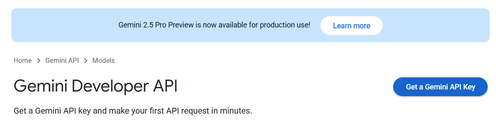
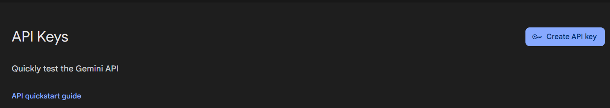
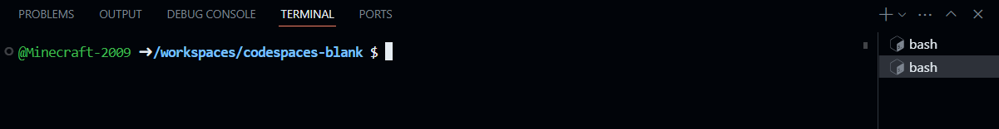

# KnotebookLM

KnotebookLM is a chat ai which you feed sources for it to research. It summarizes them, answers the user's questions about them, and will quote its sources for you. This is based of Google's "NotebookLM", but better simply because it is. KnotebookLM is an ongoing project currently in developmental phases, but major steps are being taken towards its completion and the benefits of each one of its users.

## This code
The code here is a RAG service, that is, Retrieval-Augmented Generation. It is not a chat model, but rather is a functional bit of code which will be instrumental in the chat interface. It recieves the sources the user enters, along with his prompt and other context, and serializes it into embeddings. It is in this manner that KnotebookLM is able to return to you an answer while citing its sources. While intended for KnotebookLM, it is open for the public to be used in any other projects anyone may have which requires Retrieval-Augmented Generation. This is a key part of KnotebookLM's mission to both provide a quality service as well as teaching those interested in coding, always ready to provide examples of work well done.

## Code File Outline
**`api.py`** is the server itself, which uses Flask. It is to this server that requests are made and it is this server which returns those requests with embeddings. 
"/new" is the path of the server's code for recieving and processing post requests, taking in the text and all the related information, returning the embeddings generated

**`post.py`** is the premade script which runs the post request, calling on the server made by `api.py`, which must be running for this script to function.

**`embed_and_store.py`** contains the function to add documents as well as the dotenv, pysqulite, and langchain dependencies

**`split.py`** establishes the *split_text* function utilising the langchain dependencies

**`text_split.py`** is a file used for testing the splitting of text. The text provided is an excerpt from J.R.R. Tolkien's poem *The Song of Eärendil* and this file may be modified to suit the user's needs

***`requirements.txt`*** is a simple text file in which each dependancy needed is listed plain for the user to see, simplifying the task of installing dependancies using the code below:
```
pip install requirements.txt
```

## Google API
In order for the embeddings dependancies to function, a google api key is neccesary to be stored in a `.env` file, provided, but empty with space for the user's API. This must be procured seperately from this RAG service, not yet as large as Google. See the Google [Gemini API docs](https://ai.google.dev/gemini-api/docs) for more details on the API and pricing plans. 

For a simple attaining of an API click on Get a **Gemini API Key**


Then **Create API key**


To use other API keys, use the [LangChain docs](https://python.langchain.com/docs/introduction/) to get information and code alterations. This will require alteration of the base code provided in this RAG service.

## Usage
See above sections for detail into the functions of each file.

To start the RAG service, run:
```
python api.py
```

Once the KnotebookRAG API is running, leave it be and  create a new terminal



In this new terminal, the user can run scripts which send and recieve information to and from the RAG service. `post.py` is a pre-built script to send a post request and returns the embeddings. It is encouraged to create a new file for code, as this adds a level of customizability and opprtunites to learn the workings of the code. 

## Remarks
Thank you for using KnotebookLM's RAG service. We hope you find it satisfactory. If you have any questions, comments, or concerns please email us at <knotebooklm@outlook.com> and we will get back to you within 5-7 business days. See our [terms and conditions](/terms_and_conditions.txt) for more information. Thank you again for your help in forming the KnotebookLM community.